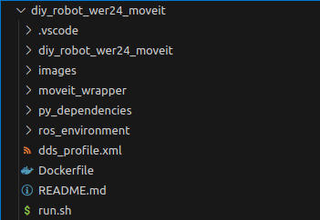

# diy_robot_wer24_moveit

## Thematical Classification
This repository contains a ROS2 package which contains the moveit configuration package and two other packages to make moveit acessable for our custom python application interface.
For the application interface please refer to this repo: https://github.com/RobinWolf/diy_robot_application


The main idea is, that this repo can be cloned inside a docker container containing and combining all description packages for the whole scene (e.g. Base, Robot, Gripper, additional obstacles)
Using differnet docker containers is very likely, because this makes the whole integration very modular. To get further informations about the general structural approach of the ROS integration, please refer to this readme: https://github.com/mathias31415/diy_robotics/blob/main/ROS-Packages/ROS-OVERVIEW.md

## Package Structure



- images and README.md are only for docomentation purposes
- Dockerfile, run.sh and dds_profile.xml are used to create the docker container where ROS is running in
- diy_robot_wer24_moveit: package which contains all of the moveit configurations
- moveit_wrapper: package which provides some custom service servers we will use later to access moveit from our application
- ros_enviroment: package which provides the cileints for the custom services (class of this package is called directly from the application)
- py_dependencies: some further dependencies to calculate manipulation transformations (like Affine transforations)

We will not need the whole scope of the moveit_wrapper, ros_enviroment and py_dependencies folders. In the following sections we will explain the packages in detail and mention, what's important for our application implementation.

## Moveit2 Configuration


#### config:

The ````./config```` folder contains config files for the embedded motion planning algorithms, kinematics solver and the hardware controller.
Only the configuration of the hardware controller must be adapted to match our controller and descrition packages. The other files can copied from reference packages such as the ROS2 integration for UniversalRobots: https://github.com/UniversalRobots/Universal_Robots_ROS2_Driver/tree/main/ur_moveit_config/config.

For the controller configuration make sure that your joint names match the ones you defined in the urdf model and the configuration of the ````joint_trajectory_controller````. Please refer to this repo for more informations abour the hardware driver and the used controllers: https://github.com/RobinWolf/diy_robotarm_wer24_driver.


```yaml
controller_names:
  - joint_trajectory_controller #moveit trys to connect to this controller defined inside the driver package (hardware interface side)

joint_trajectory_controller:
  action_ns: follow_joint_trajectory  #define some properties for the connection between hardware interface and moveit
  type: FollowJointTrajectory         #connection over a action node FollowJointTrajectory with specified namespace
  default: true
  joints:
    - "arm_shoulder"
    - "arm_upper_arm"
    - "arm_forearm"
    - "arm_wrist_1"
    - "arm_wrist_2"
    - "arm_wrist_3"
```
MoveIt connects to the joint_trajectory_controller by establishing a action server and client ````FollowJointTrajectory```` (on this topic the trajectories are published by moveit and executed by the contoller).

### srdf:

The SRDF (semantic-robot-description-format) contains all the semantic informations about our robot hardware. Base for this SRDF-definition are the definitions we've done in our full_cell_description package: https://github.com/RobinWolf/diy_robot_full_cell_description

First you define the move-gropp which should be planned by MoveIt. In our case this is ````wer24_robotarm```` and sitarts with the subframe and ends with the gripper. Make sure the name definitions match all with them specified in your URDF-model for the scene.
Next we disable collision detection for every connected link and pass the reason ````Adjacent````. If you don't do this, the robot will not move becaues the touching of adjacent links will be interpreted as a self collision.
 

```xml
  <xacro:macro name="robot_srdf" params="tf_prefix tf_prefix_sub tf_prefix_arm tf_prefix_grip">
    <!--GROUPS - Representation of a set of joints and links. This can be useful for specifying DOF to plan for, defining arms, end effectors, etc-->
    <group name="wer24_robotarm">
      <chain base_link="${tf_prefix}${tf_prefix_sub}subframe_link" tip_link="${tf_prefix}${tf_prefix_grip}base_link" />
    </group>

    <!--DISABLE COLLISIONS - By default it is assumed that any link of the robot could potentially come into collision with any other link in the robot. This tag disables collision checking between a specified pair of links. -->
    <disable_collisions link1="${tf_prefix}${tf_prefix_sub}subframe_link" link2="${tf_prefix}arm_base_link" reason="Adjacent" />
    <disable_collisions link1="${tf_prefix}${tf_prefix_arm}base_link" link2="${tf_prefix}${tf_prefix_arm}link_1" reason="Adjacent" />
    <disable_collisions link1="${tf_prefix}${tf_prefix_arm}link_1" link2="${tf_prefix}${tf_prefix_arm}link_2" reason="Adjacent" />
    <disable_collisions link1="${tf_prefix}${tf_prefix_arm}link_2" link2="${tf_prefix}${tf_prefix_arm}link_3" reason="Adjacent" />
    <disable_collisions link1="${tf_prefix}${tf_prefix_arm}link_3" link2="${tf_prefix}${tf_prefix_arm}link_4" reason="Adjacent" />
    <disable_collisions link1="${tf_prefix}${tf_prefix_arm}link_4" link2="${tf_prefix}${tf_prefix_arm}link_5" reason="Adjacent" />
    <disable_collisions link1="${tf_prefix}${tf_prefix_arm}link_5" link2="${tf_prefix}${tf_prefix_arm}link_6" reason="Adjacent" />
    <disable_collisions link1="${tf_prefix}${tf_prefix_arm}link_6" link2="${tf_prefix}${tf_prefix_grip}base_link" reason="Adjacent" />
  </xacro:macro>
```
### launch:
We have implemented two different launch scripts.

- ````robot.launch.py```` is only for thesing purposes, because only necessary nodes to control the robot-arm itself via Rviz are launched
- ````complete.launch.py```` is the launch script you should launch in the whole application. It starts all nodes for controlling the whole robot and gripper. The needed nodes to interface with our python application are lauched only here. 

## Moveit Wrapper

## ROS-Enviroment


## Launch Files and parametrized Values

